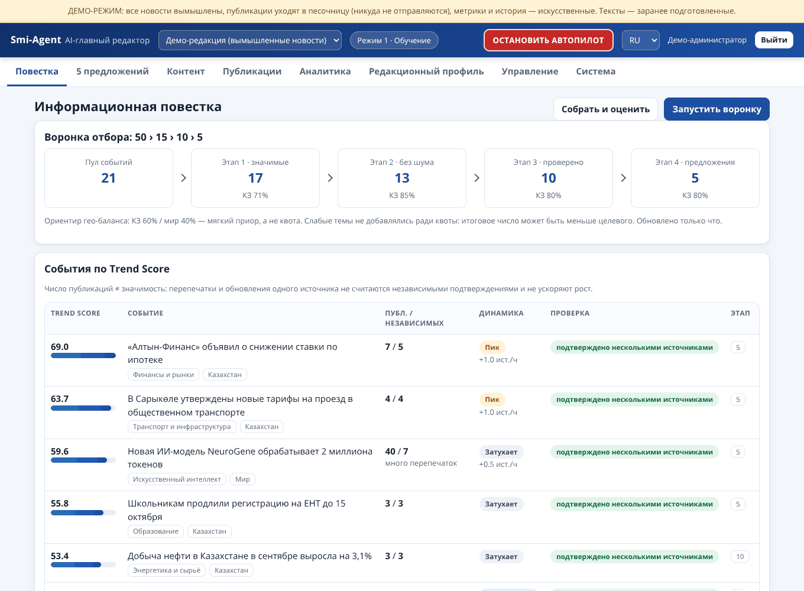
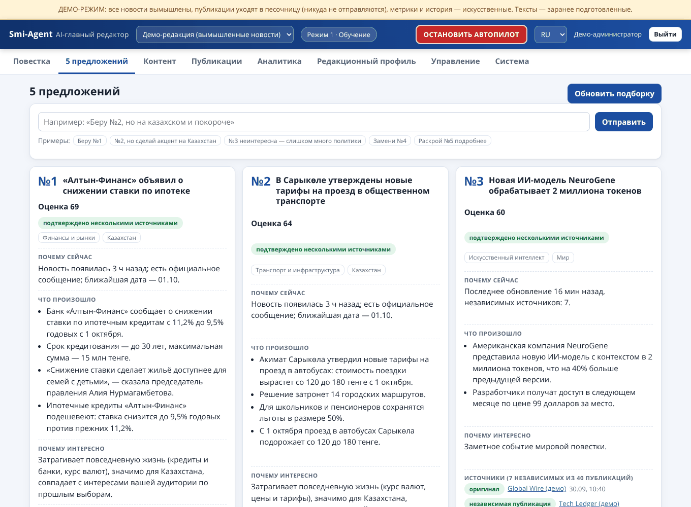
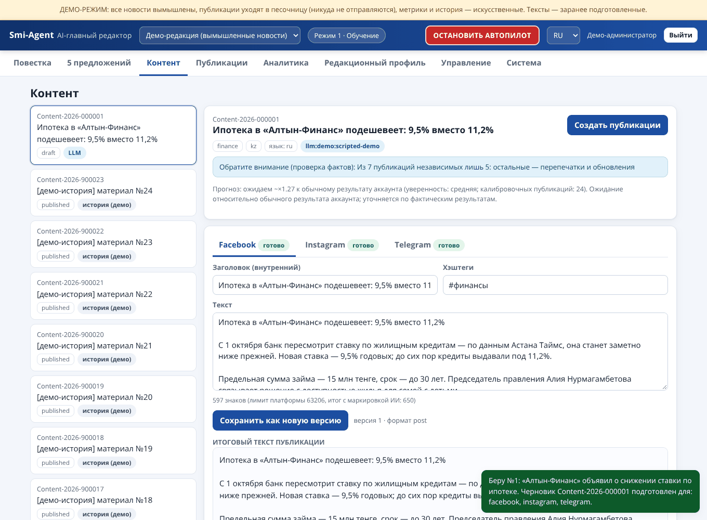
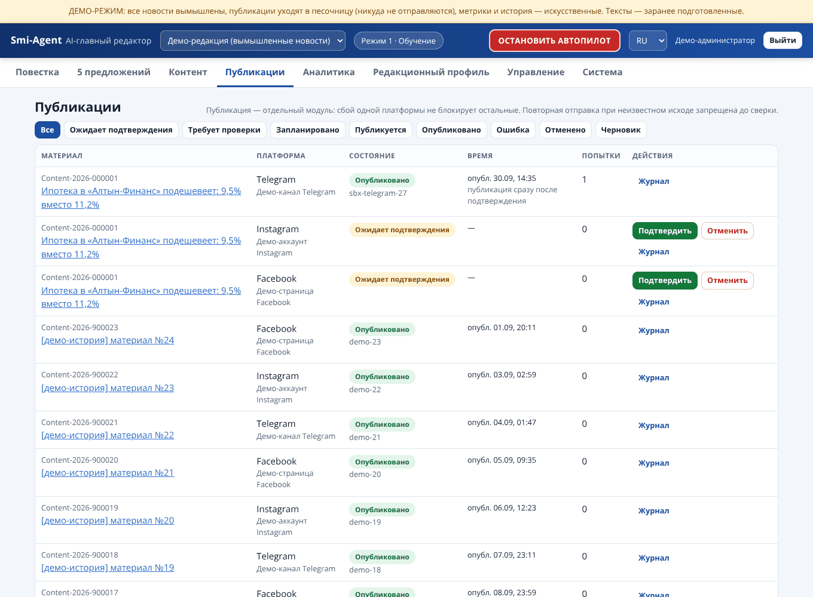
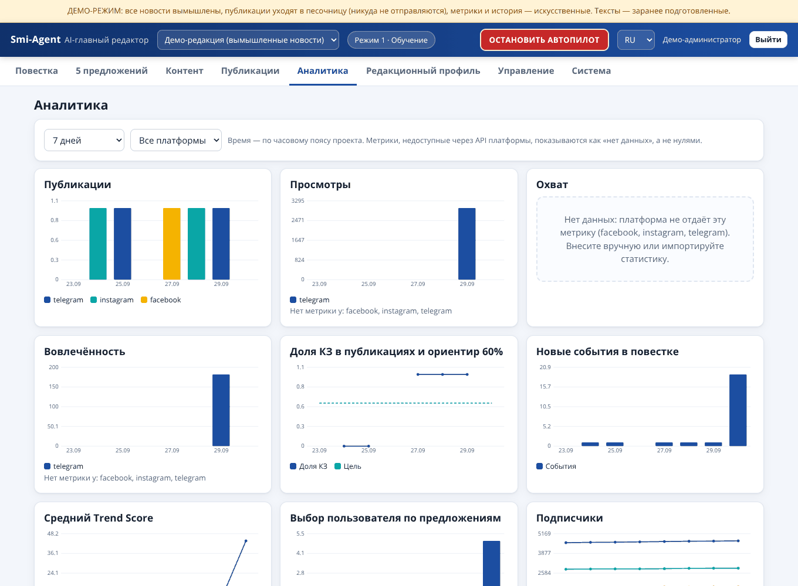
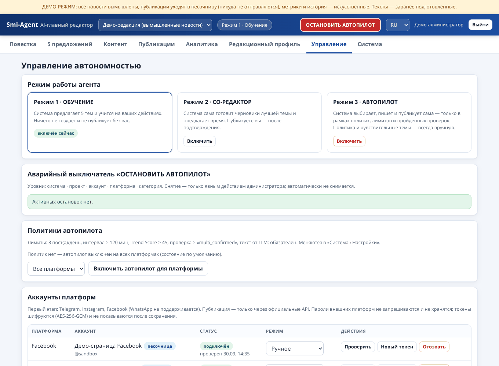

# Smi-Agent — персональный AI-главный редактор

Система для редакции (Казахстан + мир), которая **мониторит СМИ, отбирает темы, предлагает пять проверенных сюжетов, помогает написать оригинальный материал, готовит версии для Telegram / Instagram / Facebook, публикует через официальные API, анализирует результаты и учится на ваших решениях**. Реализация по «Базовому ТЗ v1.0» — все 22 модуля сквозного процесса из §61 работают вместе: от сбора лент до обратной связи в обучение.

> Это **не агрегатор, не рерайтер и не авторепостер** (§62): текст создаётся только из проверенной базы фактов, проходит автоматические проверки оригинальности, а публикация без человека возможна лишь в режиме «Автопилот» — выключенном по умолчанию и действующем в жёстких рамках.



<details><summary>Ещё скриншоты (демо-данные: вымышленные новости)</summary>

| 5 предложений | Контент (проверки, итоговый текст с маркировкой ИИ) |
|---|---|
|  |  |

| Публикации (8 состояний) | Аналитика |
|---|---|
|  |  |



</details>

## Что делает система

```
ленты СМИ → сбор и нормализация → события (1 событие = N источников; перепечатки, переводы, обновления)
        → Trend Score (13 компонентов; скорость роста — только по независимым источникам)
        → воронка  пул → 50 → 15 → 10 проверенных → 5 предложений  (мягкий приор 60/40 КЗ/мир, без «добивки» слабыми темами)
        → вы решаете: «Беру №2», «№4, но акцент на Казахстан», «№1 неинтересна», «Замени №3», «Раскрой №5 подробнее»
        → оригинальный текст по базе фактов → версии для TG / IG / FB → карточки → проверки перед публикацией
        → подтверждение (или автопилот в рамках политик) → публикация → статистика → аналитика → обучение профиля
```

| Раздел интерфейса | Что внутри |
|---|---|
| **Повестка** | воронка 50→15→10→5, события по Trend Score, «из чего сложилась оценка», динамика источников, здоровье лент |
| **5 предложений** | карточка: название · почему сейчас · что произошло · почему интересно · источники · степень проверки · угол · формат; текстовые команды |
| **Контент** | редактор по платформам, проверки (числа, цитаты, оригинальность, политика, медиа), итоговый текст с маркировкой ИИ, карточки/слайды |
| **Публикации** | 8 состояний (Черновик … Отменено), подтверждение, время («сразу / оптимальное / указать»), журнал попыток, сверка |
| **Аналитика** | графики за сегодня/7д/30д/3м/6м/год/свой период, гео-баланс, прогноз vs факт, закономерности, отчёты, импорт статистики |
| **Редакционный профиль** | что система поняла о ваших предпочтениях, анализ вашего выбора, явные настройки |
| **Управление** | режимы (Обучение · Со-редактор · Автопилот), политики, аккаунты, аварийный выключатель |
| **Система** | источники, настройки, пользователи и роли, API-токены, журнал аудита, состояние, резервные копии |

## Быстрый старт (демо, 1 минута)

Демо использует **вымышленные** новости, «песочницу» вместо платформ (ничего никуда не отправляется) и искусственные метрики. Тексты — заранее подготовленные «демо-LLM» (проходят те же проверки).

```bash
python -m venv .venv && . .venv/bin/activate
pip install -e ".[dev]"
scripts/run-demo.sh          # http://localhost:8000   логин: demo   пароль: smi-agent-showcase
```

Без bash — одна и та же команда на Windows, Linux и macOS: `smi-agent serve --demo` (данные во временной папке, при каждом запуске создаются заново; `--port`, `--demo-dir`). Пошаговая инструкция для Windows — ниже.

Или в Docker: `SMI_DEMO_MODE=1 docker compose up --build` (см. замечание о Docker ниже).

Что попробовать: **5 предложений → «Беру» → Контент → «Создать публикации» → Публикации → «Подтвердить»**; затем **Управление → Автопилот** (включается админом, политика + режим аккаунта «auto»), и красная кнопка **«ОСТАНОВИТЬ АВТОПИЛОТ»** в шапке.

### Запуск на Windows (без WSL и Docker)

Нужен **Python 3.11 или новее**: [python.org/downloads](https://www.python.org/downloads/) (в установщике отметьте **Add python.exe to PATH**) или `winget install Python.Python.3.13`. Проверка: `py --version`.

**Вариант 1 — двойной клик.** Скачайте репозиторий (*Code → Download ZIP* или `git clone`), распакуйте и запустите `scripts\run-demo.cmd`. Первый запуск создаёт окружение и ставит зависимости (1–2 минуты), затем печатает адрес: <http://localhost:8000>, логин `demo`, пароль `smi-agent-showcase`. Остановка — `Ctrl+C` (на вопрос о завершении пакетного файла ответьте `Y`). Если Windows предупреждает, что не удалось проверить издателя, — это обычное предупреждение для файла из интернета; скрипт короткий, его можно прочитать в Блокноте (при `git clone` предупреждения нет). Аргументы передаются дальше: `scripts\run-demo.cmd --port 8080`.

**Вариант 2 — PowerShell в папке проекта:**

```powershell
py -m venv .venv
.\.venv\Scripts\python.exe -m pip install -e .
.\.venv\Scripts\smi-agent.exe serve --demo
```

Окружение активировать не нужно — и тогда не мешает политика PowerShell («выполнение сценариев отключено в этой системе»). Если всё же хотите короткое `smi-agent …`: `Set-ExecutionPolicy -Scope CurrentUser RemoteSigned`, затем `.\.venv\Scripts\Activate.ps1`.

**Рабочая установка (один узел, SQLite)** — в PowerShell, из папки проекта:

```powershell
py -m venv .venv
.\.venv\Scripts\python.exe -m pip install .
Set-Content -Encoding utf8 .env "SMI_ENV=dev","SMI_EMBEDDED_WORKER=1"    # файл настроек (можно создать и в Блокноте — кодировка UTF-8)
.\.venv\Scripts\smi-agent.exe init --admin admin --project main   # пароль спросит интерактивно
.\.venv\Scripts\smi-agent.exe serve
```

Для локального запуска в `.env` достаточно двух строк: `SMI_ENV=dev` и `SMI_EMBEDDED_WORKER=1` (фоновые задания внутри сервера). После `serve` откройте <http://localhost:8000> и войдите под созданным администратором. Что важно на Windows:

- **Не создавайте `.env` командой `echo … > .env`**: в Windows PowerShell 5.1 она пишет UTF-16, и программа остановится с сообщением об этом. Используйте Блокнот (UTF-8) или `Set-Content -Encoding utf8`, как выше. Запускайте команды из папки, где лежит `.env`.
- Значения из `.env.example` (`/data`, `/backups`, `SMI_ENV=production`) рассчитаны на Docker/Linux — не копируйте их как есть. Пути на Windows: `SMI_DATA_DIR=C:\smi\data`, `SMI_DATABASE_URL=sqlite:///C:/smi/smi_agent.db` (три слэша после `sqlite:` и прямые слэши в пути).
- **Не держите `data\` и `backups\` в OneDrive/Dropbox и на сетевых дисках**: SQLite (режим WAL) на них работает ненадёжно, синхронизация блокирует файлы («database is locked»). Папки «Документы» и «Рабочий стол» часто синхронизируются OneDrive — выберите, например, `C:\smi`.
- Права `0600` на файлы ключей на Windows не применяются: доступ определяют права папки. Для production ключи храните в переменных окружения или менеджере секретов ([docs/SECURITY.md](docs/SECURITY.md)).
- Порт занят — `--port 8080`. Сервер слушает только `127.0.0.1`, поэтому предупреждения брандмауэра нет.
- **Production на Windows не проверялся** (HTTPS-прокси, MFA, автозапуск службой): для него рекомендуются Linux и Docker. Автозапуск см. [docs/OPERATIONS.md](docs/OPERATIONS.md).

## Рабочая установка

```bash
pip install .                                   # или: pip install ".[postgres]"
cp .env.example .env                            # заполнить (ключи: smi-agent keys generate)
smi-agent init --admin admin --project main     # БД, проект с источниками, администратор (пароль — интерактивно)
smi-agent serve --host 0.0.0.0 --port 8000      # веб + API
smi-agent worker                                # фоновые задания (или SMI_EMBEDDED_WORKER=1 для одного узла)
```

Дальше в интерфейсе: *Управление → Аккаунты* (токены официальных API: бот Telegram — администратор канала; Instagram/Facebook — Graph API; подробности в [docs/INTEGRATIONS.md](docs/INTEGRATIONS.md)), *Система → Источники* (проверьте адреса лент), *Редакционный профиль*. Для генерации текстов подключите LLM ([docs/LLM.md](docs/LLM.md)).

Команды CLI: `init`, `serve`, `worker`, `keys generate|rotate`, `user create|reset-password`, `backup create|list|verify|restore|restore-test`, `demo seed|reset`, `run pipeline|funnel`, `health`, `audit-verify`.

## Статус: что реализовано и что проверено (честно)

Проверено автоматически: **277 тестов** (`pytest`, ~2 минуты, без сети; в CI — на Linux и Windows, Python 3.11 и 3.14) + ручной прогон интерфейса в headless-Chromium (сквозной сценарий демо без ошибок в консоли).

| Область | Статус |
|---|---|
| Сбор (RSS/Atom/sitemap/JSON Feed/HTML-список), SSRF-защита, robots.txt, ETag/304, бэкофф, здоровье источников | ✅ тесты (на подменённом транспорте) |
| События, дедупликация, независимые источники, перепечатки/переводы/обновления, кросс-язык (ru/kk/en) | ✅ тесты на синтетическом корпусе; эвристика, не эмбеддинги (см. ограничения) |
| Trend Score (13 компонентов), фазы жизни, воронка 50→15→10→5, верификация, карточки, команды | ✅ тесты |
| Обучение/профиль, прогноз vs факт, закономерности, отчёты, дашборд из шести разделов | ✅ тесты |
| Генерация: база фактов → текст → проверки (числа, цитаты, оригинальность, политика) → TG/IG/FB → карточки | ✅ тесты с programmable-LLM; **качество текстов реальной LLM не проверялось** |
| Публикация: конечный автомат, атомарный захват, идемпотентность, сверка, повторы, выключатель, автопилот | ✅ тесты (песочница + `MockTransport`) |
| **Реальные API Telegram / Instagram / Facebook** | ⚠️ **не проверялись**: из среды разработки недоступны; адаптеры написаны по документации и тестируются на моках ответов |
| Реальные ленты КЗ-СМИ | ⚠️ проверены вручную только NUR.KZ и Kursiv (через веб-поиск); остальные адреса помечены «не проверена» — система покажет сбои опроса |
| **Windows** | ✅ CI на GitHub Actions (`windows-latest`, Python 3.11 и 3.14): установка, все тесты, демо `smi-agent serve --demo` (вход → пять предложений → выбор темы → материал → карточка JPEG) и лаунчер `scripts\run-demo.cmd`. ⚠️ Это Windows Server с английской локалью; на обычной Windows 10/11 вручную **не запускалось**; production на Windows не проверялся |
| PostgreSQL | ⚠️ код переносим (SQLAlchemy, `FOR UPDATE`, триггеры для PG), но **не запускался** |
| Docker / compose / Caddy | ⚠️ файлы написаны, **не собирались** (Docker в среде отсутствовал) |
| Видео для Reels | ➖ генерация видео не выполняется: сценарий и обложка — да; публикация Reels требует загрузки готового видео |

## Принципы, которые соблюдает система

- **Независимость источников важнее числа публикаций.** 40 перепечаток одного агентства — это 1 источник: в демо событие «40 публикаций / 7 независимых» оценивается ниже темы с первичным источником.
- **Нет «добивки».** Если достойных тем меньше пяти — предложений будет меньше; каждое отсеянное событие хранится с причиной.
- **Текст только из фактов.** Число, цитата или ссылка, которых нет в базе фактов, отклоняются; «слишком близко к источнику» — тоже. Без LLM система честно выдаёт *заготовку для редактора* (она не пройдёт проверку оригинальности, пока вы не перепишете её).
- **Публикация — отдельный модуль.** Сбой одной платформы не блокирует другие; при неизвестном исходе отправки **повтор запрещён**, пока не доказано, что поста нет (сверка или явное решение человека).
- **Автопилот выключен по умолчанию**, включается отдельно администратором; политика, чувствительные темы, тексты-заготовки, непройденные проверки и остановка выключателем всегда блокируют автопубликацию.
- **Безопасность:** шифрование секретов (AES-256-GCM), MFA, CSRF, строгий CSP, SSRF-защита, неизменяемый журнал аудита с хеш-цепочкой, отзыв доступа, шифрованные резервные копии. См. [docs/SECURITY.md](docs/SECURITY.md).
- **Пароли внешних платформ не запрашиваются и не хранятся**; публикация — только через официальные API. WhatsApp на первом этапе не поддерживается.
- **Маркировка ИИ** (закон РК «Об искусственном интеллекте», 2026) включена по умолчанию: текстовая пометка во всех публикациях, метка и метаданные на ИИ-изображениях.

## Документация

| Файл | О чём |
|---|---|
| [docs/ARCHITECTURE.md](docs/ARCHITECTURE.md) | модули (соответствие §61), поток данных, алгоритмы, расширение без правки ядра |
| [docs/TRACEABILITY.md](docs/TRACEABILITY.md) | матрица «пункт ТЗ → код → тесты → статус» |
| [docs/SECURITY.md](docs/SECURITY.md) | модель угроз, меры, секреты, аудит, ограничения |
| [docs/OPERATIONS.md](docs/OPERATIONS.md) | развёртывание, мониторинг, резервные копии (RPO/RTO), восстановление, ротация ключей, регламенты |
| [docs/INTEGRATIONS.md](docs/INTEGRATIONS.md) | Telegram/Instagram/Facebook: права, лимиты, метрики; реестр источников |
| [docs/LLM.md](docs/LLM.md) | подключение LLM, промпты, защитные проверки, бюджет |

## Известные ограничения

- Близость материалов — лексико-числовая (TF-IDF + сущности + числа + цитаты). Слабо связанные материалы на разных языках без общих чисел/сущностей (например, два коротких рассказа о находке в Перу) могут остаться отдельными событиями. Точка расширения — векторные эмбеддинги (см. ARCHITECTURE).
- Схема БД создаётся `create_all` (идемпотентно добавляет таблицы); версионных миграций (Alembic) пока нет — для изменений схемы в продакшене потребуется миграционный инструмент.
- Метрики: у Telegram Bot API нет статистики постов канала (есть ручной ввод/импорт); Meta периодически меняет доступные метрики — недоступные показываются как «нет данных», а не нулями.
- Instagram требует **публично доступный HTTPS-адрес** для изображений (`SMI_PUBLIC_URL`); локально без туннеля публикация в IG невозможна.
- Часовые пояса, расписание и «оптимальное время» опираются на статистику ваших постов; при малом объёме данных используются часы по умолчанию.

## Разработка

```bash
pip install -e ".[dev]"
ruff check src tests scripts
pytest -q                     # 277 тестов
```

Структура: `src/smi_agent/{ingestion,events,scoring,funnel,verification,proposals,interaction,learning,profile,content,visual,checks,publishing,analytics,ops,security,audit,llm,api,web,demo}`; тестовые данные — вымышленные (`tests/fixtures/corpus.py`, `src/smi_agent/demo/corpus.py`).

Шрифт карточек — DejaVu Sans (свободная лицензия, см. `src/smi_agent/assets/fonts/LICENSE-DejaVu.txt`).
